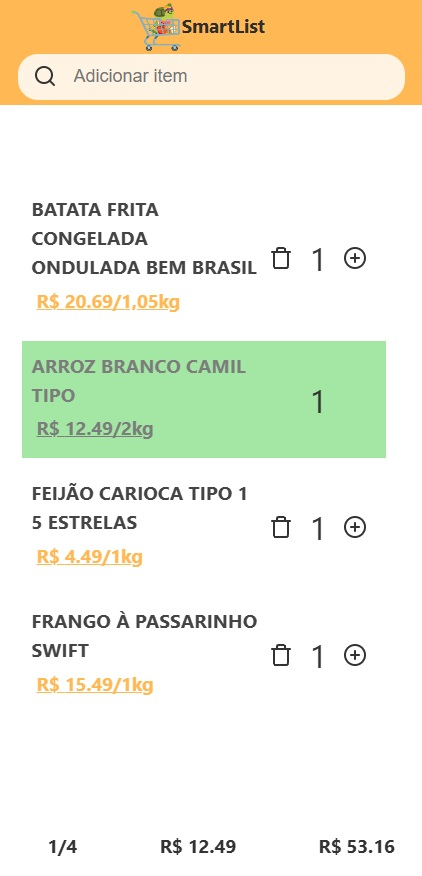

# SmartList

SmartList é uma aplicação de lista de compras que permite você checar preços de produtos de supermercado de forma prática e organizada.

## Descrição

Com SmartList, você pode criar e gerenciar sua lista de compras e verificar os preços atualizados dos produtos em diferentes supermercados, ajudando a economizar tempo e dinheiro.

## Tecnologias Utilizadas

- **Frontend:** React, JavaScript, HTML, CSS, Sass  
- **Backend:** PHP, Python

## Funcionalidades

- Criar, editar e remover itens da lista de compras  
- Consultar preços de produtos em supermercados  
- Interface intuitiva e responsiva  
- Estilização com Sass para melhor organização do CSS  

## Como Rodar o Projeto

1. Acesse https://thacarv.github.io/SmartList/
